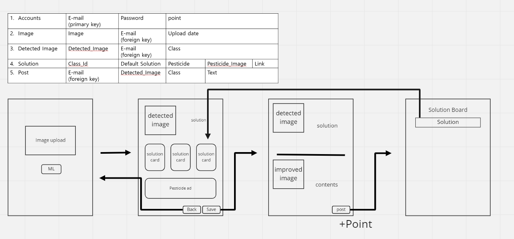

 - 인증(Token 발급 및 갱신) 관련 API
> 
>   | HTTP | Path | Permission | Body | 목적 |
>   | --- | --- | --- | --- | --- |
>   |**GET** |/accounts/user| Access Token | None |유저정보|
>   |**POST** |/accounts/login | None | email, password | 로그인 |
>   |**POST** |/accounts/logout| None | Refresh Token | 로그아웃 |
>   |**POST** |/accounts/registration| None | email, password1, password2 | 회원가입 |
>   |**POST** |/accounts/token/verify| Access Token | Access Token |유효기간 확인|
>   |**POST** |/accounts/token/refresh| Access Token | Refresh Token |Access Token refresh|

---

 - 이미지 업로드 API
>   | HTTP | Path | Permission | Body | 목적 |
>   | --- | --- | --- | --- | --- |
>   |**GET** |/image | Access Token | email, image | 이미지 가져오기 |
>   |**POST** |/image | Access Token | FormData | 이미지 업로드 |
>   |**GET** |/detected_image | Access Token | email, detected_image | 로그인 유저의 이미지 가져오기 |

---
 - ML API
>   | HTTP | Path | Permission | Body | 목적 |
>   | --- | --- | --- | --- | --- |
>   |**GET** |/ML | None | None | yoloV5 |
>   |**POST** |/ML/test | None | Image files | 이미지 유사도 분석 with FastAPI 테스트중 |

---
 - Posts
>   | HTTP | Path | Permission | Body | 목적 |
>   | --- | --- | --- | --- | --- |
>   |**GET** |/post/solutions | Access Token | email, detected_image, detected_class, detected_default_solution, detected_contents, solution_image, solution_contents, is_public | 공개된 솔루션 게시물 가져오기 |
>   |**GET** |/post/solutions | Access Token | email, detected_image, detected_class, detected_default_solution, detected_contents, solution_image, solution_contents, is_public | 로그인 유저의 솔루션 게시물 가져오기 |
>   |**POST** |/post/solutions | Access Token | email, detected_image, detected_class, detected_default_solution, detected_contents, solution_image, solution_contents, is_public | 솔루션 게시물 업로드 | 
---

---
 - Default solutions
>   | HTTP | Path | Permission | Body | 목적 |
>   | --- | --- | --- | --- | --- |
>   |**GET** |/solutions | None | None | yoloV5 |
>   |**POST** |/solutions | SuperUser | solution_id, solution_default, pesticide, pesticide_image, pesticide_link | 이미지 유사도 분석 with FastAPI |

---
 ## Workflow
